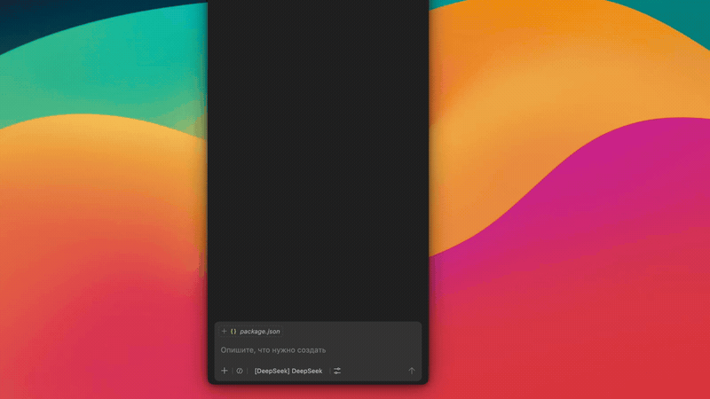
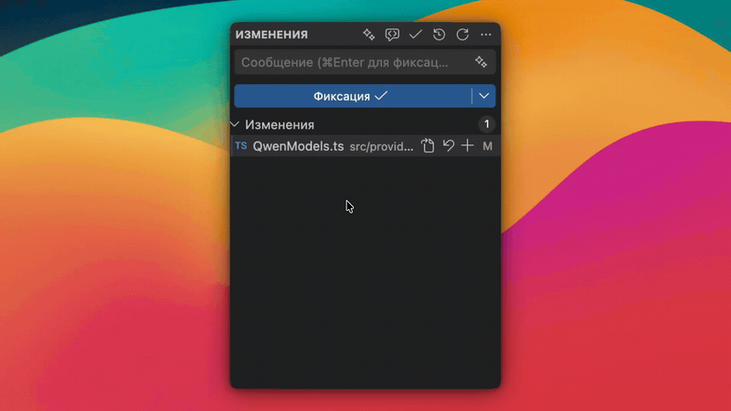
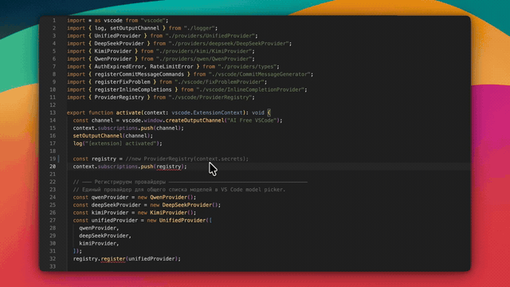

# 🚀 AI Free VSCode

[](https://github.com/AppsGanin/ai-free-vscode/stargazers)
[](https://github.com/AppsGanin/ai-free-vscode/network)
[](https://github.com/AppsGanin/ai-free-vscode/watchers)
[](LICENSE)
[](https://code.visualstudio.com)
[](https://marketplace.visualstudio.com/items?itemName=AppsGanin.free-ai-vscode)
[](https://marketplace.visualstudio.com/items?itemName=AppsGanin.free-ai-vscode)
[](https://marketplace.visualstudio.com/items?itemName=AppsGanin.free-ai-vscode)

> Use free AI models directly in Copilot Chat without API keys, billing, or token counting.

**AI Free VSCode** connects free web-based models through a Playwright browser session — or through a vendor CLI you already have installed, like MiMo Code — and registers them as a Copilot Chat provider.

## What it does

- ✅ Integrates free web-based AI models into Copilot Chat
- ✅ Requires no API keys and does not use paid OpenAI endpoints
- ✅ Authenticates via a real browser session (MiMo needs no sign-in at all)
- ✅ Supports streaming, automatic thinking mode, and tool calling
- ✅ Exposes models through a unified provider for VS Code
- ✅ Generates commit messages from your staged diff
- ✅ Inline code suggestions (ghost text) on demand
- ✅ "Fix with AI" Quick Fix on errors/warnings, with a diff preview

Only models from providers you are signed into appear in the picker — no
dead entries that fail on use.

## Demo

### Chat



### Generate commit messages



### Fix with AI



## Supported models

### Qwen

| Model        | ID             | Context |
| ------------ | -------------- | ------- |
| Qwen3.7 Plus | `qwen3.7-plus` | 1M      |
| Qwen3.7 Max  | `qwen3.7-max`  | 1M      |
| Qwen3.6 Plus | `qwen3.6-plus` | 1M      |
| Qwen3.5 Plus | `qwen3.5-plus` | 1M      |

### DeepSeek

| Model           | ID                 | Context |
| --------------- | ------------------ | ------- |
| DeepSeek        | `deepseek-default` | 128K    |
| DeepSeek Expert | `deepseek-expert`  | 128K    |

### Kimi

| Model     | ID          | Context |
| --------- | ----------- | ------- |
| Kimi K2.5 | `kimi-k2.5` | 128K    |

> ⚠️ **Tool calling is disabled for Kimi** (it is not advertised as a
> tool-capable model, so VS Code won't pick it for agent/tool turns). Instead of
> the text tool-call protocol, Kimi falls back to its built-in `ipython` code
> interpreter and runs a server-side agent loop we cannot feed results to —
> slow (often minutes) and unreliable. Use Kimi for plain chat; pick Qwen or
> DeepSeek when you need tools.

### MiMo Code (CLI)

Xiaomi's MiMo, wired through the official
[MiMo Code CLI](https://github.com/XiaomiMiMo/MiMo-Code) instead of a browser
session — no API key, no sign-in, nothing stored by the extension.

| Model            | ID          | Context |
| ---------------- | ----------- | ------- |
| MiMo Auto (free) | `mimo-auto` | 1M      |

Setup is the install itself:

```bash
npm install -g @mimo-ai/cli   # or: curl -fsSL https://mimo.xiaomi.com/install | bash
mimo                          # first run: pick "MiMo Auto" (free, anonymous)
```

Only the free anonymous channel is exposed; the paid `xiaomi/*` models are
deliberately left out, since they need a MiMo account. The model appears in the
picker as soon as `mimo models` reports it. If the binary lives outside
`~/.mimocode/bin` and `PATH`, point **`freeAI.mimo.path`** at it.

## How it works

1. The extension registers a single Copilot Chat provider: `free-ai-vscode`.
2. Signing in launches Playwright and stores the authenticated session in `SecretStorage`
   (MiMo is the exception — it needs no sign-in at all, just the CLI, see below).
3. Requests are routed through the providers' private API streams (see [Supported models](#supported-models)).
4. Responses are delivered to VS Code as streamed chunks.
5. The extension handles tool calling and thinking-mode when available.

### Qwen and the Aliyun WAF

`chat.qwen.ai` sits behind the Aliyun WAF and Alibaba's anti-bot layer, which
reject plain server-side requests. Qwen keeps working through a two-tier flow:

**1. Direct request (fast path).** The Qwen client calls the API directly from
Node while mirroring the request headers the web app sends (`source`, `version`,
`x-request-id`, `timezone`, `bx-v`). That is enough to pass the WAF for most
endpoints (e.g. creating a chat), and responses stream natively.

**2. Browser bridge (fallback).** When a response is a challenge instead of the
expected stream — an HTML challenge page, or an `x5sec` / `RGV587`
(`FAIL_SYS_USER_VALIDATE`) JSON body — the request is transparently replayed
inside the real browser session, which carries the genuine cookies and browser
network fingerprint the WAF trusts. The SSE response is still streamed back to
VS Code chunk by chunk.

The bridge reuses the persistent profile created at sign-in
(`~/.ai-free-vscode/browser-profile`), so no extra login is needed, and it
degrades gracefully:

1. **Headless + stealth** first — no visible window (fingerprint is masked so the
   anti-bot treats the session as a normal browser).
2. If the anti-bot detects it, the bridge **escalates to a real (headed) Chrome**
   automatically, with its window minimized so it stays out of your way.
3. If a one-time **captcha** is required, that window is brought to the front and
   a notification appears — solve it once, then resend your request. The
   verification cookie is stored in the profile, so you are not asked again for a
   while.

You normally don't need to touch this, but you can pin the browser mode in
**Settings → AI Free VSCode → `freeAI.qwen.browserMode`** (`auto` / `headed` /
`headless`; changing it needs a window reload).

> This is a best-effort resilience layer. Provider-side anti-bot rules change
> frequently, so a blocked Qwen request may still occasionally surface — retrying
> usually clears it.

### MiMo and the CLI bridge

MiMo needs no browser, no key and no sign-in: the extension drives the locally
installed `mimo` CLI on its free anonymous channel.

On the first MiMo request it starts a headless mimocode server
(`mimo serve` on a random loopback port, protected with a random Basic-auth
password) and talks to it over HTTP + SSE, which streams the answer token by
token and supports cancellation. The server is configured in-memory
(`MIMOCODE_CONFIG_CONTENT`) with a single tools-free agent, so mimocode acts as
a plain transport: file edits, terminal commands and tool calls stay on the
Copilot Chat side. Your `mimocode.jsonc` is never modified. The server shuts
down after 10 minutes of inactivity, and each request uses a throwaway session.

## Installation

### From the VS Code Marketplace (recommended)

[](https://marketplace.visualstudio.com/items?itemName=AppsGanin.free-ai-vscode)

- In VS Code, open the **Extensions** view (`Cmd+Shift+X` / `Ctrl+Shift+X`), search for **AI Free VSCode**, and click **Install**.
- Or from the command line:
  ```bash
  code --install-extension AppsGanin.free-ai-vscode
  ```
- Or open it directly on the [Marketplace page](https://marketplace.visualstudio.com/items?itemName=AppsGanin.free-ai-vscode).

### From a VSIX (manual)

1. Download the latest `free-ai-vscode-*.vsix` from the [Releases](https://github.com/AppsGanin/ai-free-vscode/releases) page.
2. In VS Code, open Extensions → `···` → **Install from VSIX...**.
3. Reload VS Code.

## Quick start

1. Open Command Palette (`Cmd+Shift+P` / `Ctrl+Shift+P`).
2. Run the sign-in command:
   - `AI Free VSCode — Sign In`
3. Choose a provider from the list (see [Supported models](#supported-models)).
4. Sign in with your browser and wait for success.
   **MiMo Code (CLI)** has no sign-in: if the CLI is missing, a terminal opens to
   install it, then run `AI Free VSCode — Status`.
5. Open Copilot Chat and select a model.

To sign out:

- `AI Free VSCode — Sign Out`

To check auth status:

- `AI Free VSCode — Status`

## Editor features

Besides Copilot Chat, the extension adds a few editor integrations powered by the
same free models. All of them respect your sign-in state and use thinking off for
speed.

### Commit message generation

A ✨ button in the **Source Control** view title bar generates a commit message
from your staged diff (falls back to the working-tree diff). The message streams
straight into the commit input box.

- Model: `freeAI.commit.model` (`auto` = first available)
- Prompt: `freeAI.commit.prompt` (Conventional Commits, English by default)
- Pick a model quickly: command `AI Free VSCode — Change Commit Model`

### Inline suggestions (ghost text)

On-demand code completion at the cursor. It is **manual only** — it never fires
while typing.

- Trigger: `Ctrl+Alt+\` (Mac `Cmd+Alt+\`), or command
  `AI Free VSCode — Inline suggestion`, or the built-in _Trigger Inline Suggestion_
- Accept with `Tab`, dismiss with `Esc`
- Enable first: set `freeAI.suggestions.enabled` to `true` (the hotkey will offer
  to enable it)
- Model: `freeAI.suggestions.model` (`auto` = first available)
- Pick a model quickly: command `AI Free VSCode — Change Completions Model`

> These backends run through a web session (DeepSeek also solves a PoW challenge),
> so expect noticeably higher latency than native Copilot.

### Fix with AI (Quick Fix)

When there is a red error or yellow warning, open the lightbulb (`Cmd+.` /
`Ctrl+.`) and choose **✨ Fix with AI Free**. The model rewrites the affected
lines (indentation is preserved) and shows a **diff preview** with Apply / Cancel
before changing the file.

- Toggle the action: `freeAI.fix.enabled`
- Model: `freeAI.fix.model` (`auto` = first available)
- Pick a model quickly: command `AI Free VSCode — Change Fix Model`

## Configuration

| Setting                             | Default  | Description                                                    |
| ----------------------------------- | -------- | -------------------------------------------------------------- |
| `freeAI.playwright.timeout`         | `120000` | Browser sign-in timeout in milliseconds                        |
| `freeAI.qwen.browserMode`           | `auto`   | Qwen anti-bot fallback browser: `auto` / `headed` / `headless` |
| `freeAI.commit.enabled`             | `true`   | Show the ✨ commit message generation button in Source Control |
| `freeAI.commit.model`               | `auto`   | Model for commit messages (`auto` = first available)           |
| `freeAI.commit.prompt`              | —        | Instruction prepended to the diff for commit generation        |
| `freeAI.suggestions.enabled`        | `false`  | Enable manual inline ghost-text suggestions                    |
| `freeAI.suggestions.model`          | `auto`   | Model for inline suggestions                                   |
| `freeAI.suggestions.maxPrefixChars` | `2000`   | Chars of code before the cursor sent to the model              |
| `freeAI.suggestions.maxSuffixChars` | `800`    | Chars of code after the cursor sent to the model               |
| `freeAI.fix.enabled`                | `true`   | Show the "Fix with AI Free" Quick Fix on diagnostics           |
| `freeAI.fix.model`                  | `auto`   | Model for fixing problems                                      |

Thinking (reasoning) is automatic: enabled in plain chat, disabled when tools are
active (reasoning is unreliable with tool calling on these backends).

## Development

```bash
git clone https://github.com/AppsGanin/ai-free-vscode
cd ai-free-vscode
npm install
# If you need local Chromium for development:
npx playwright install chromium
```

Run the extension in VS Code with `F5`.

### Enabling/disabling providers at build time

Each provider can be excluded from a build via a `PROVIDER_<NAME>=false`
environment variable (accepted falsy values: `false`, `0`, `off`, `no`).
By default all providers are included. The build prints the active set, e.g.
`[build] enabled providers: deepseek, kimi`.

```bash
# Build without Qwen
PROVIDER_QWEN=false npm run bundle

# Build with only DeepSeek (drop Qwen, Kimi and MiMo)
PROVIDER_QWEN=false PROVIDER_KIMI=false PROVIDER_MIMO=false npm run bundle

# Package a VSIX without Qwen
PROVIDER_QWEN=false npm run bundle && npm run package
```

Provider keys: `qwen`, `deepseek`, `kimi`, `mimo`. Adding a new provider means
registering its key in [`src/providers/providerConfig.ts`](src/providers/providerConfig.ts),
[`esbuild.js`](esbuild.js), and the factory map in [`src/extension.ts`](src/extension.ts).

## Requirements

- VS Code `^1.105.0`
- System Chrome or network access for Playwright to download Chromium
- For the MiMo provider only: the [MiMo Code CLI](https://github.com/XiaomiMiMo/MiMo-Code)
  (`npm i -g @mimo-ai/cli`) and Node.js 18+

## Important notice

This is an unofficial extension. Authentication is handled through a browser session, and the integration may break if providers change their web APIs or terms.

> Use at your own risk. Web session automation may violate provider policies.

## 💝 Support the project

AI Free VSCode is built in spare time and distributed for free. If the extension has been useful, you can support its development.

The easiest way is via **[DonationAlerts](https://www.donationalerts.com/r/dmitryapp)** or **[Boosty](https://boosty.to/githubapps)** (one-time or recurring). You can also donate in USDT — pick a
network and **carefully** copy the address (the sender's and recipient's networks must match):

| Network          | Token | Address                                            |
| ---------------- | ----- | -------------------------------------------------- |
| TRC20 (Tron)     | USDT  | `TJwyrPVEZVZ1YrcmDiZTyFjLo3Q2DmEGzs`               |
| ERC20 (Ethereum) | USDT  | `0xf9d663146ce902da91911b214c71cc73a5269d1d`       |
| Solana           | USDT  | `2qAZRTbaUMTfYuZbD1dCYHjkYgxkw4dUYE9XY3JhC2Cs`     |
| TON              | USDT  | `UQDoat731MLYuIw8ayL3Vhhw7zTBbLvRaQFmDvab--CNNI7e` |

If you also use Bybit, the simplest option is a transfer by **UID** (instant and fee-free):

| Exchange | UID         |
| -------- | ----------- |
| Bybit    | `136462734` |

> The cheapest fees are on the **TRON (TRC20)** and **TON** networks. Send only
> **USDT** and only on the specified network — a transfer on the wrong network is unrecoverable.

Thanks for your support! 🙏
